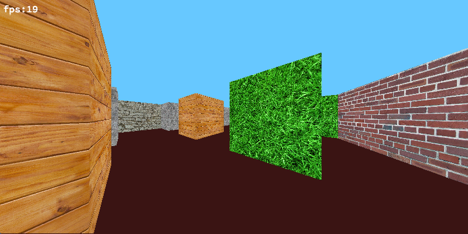

# Wolf3d - 42/Unit Factory

This project create program, which emulate popular game in 90th - Wolfenstein 3d. But it is easy version - only map and move of player, no shot and enemies.

This project work only MacOS system.
Used graphic "MiniLibX" library.

1. Use "make" to compile program.
2. run ./wolf3d

# CONTROLS:

# Move:

'`W`' - Up

'`S`' - Down

'`Q`' - Left

'`E`' - Righ

'`SHIFT`' - Speed

# Rotate:

'`A`' - to left

'`D`' - to right

# Zoom:

'`+`' or '`-`' - zoom

# Map:

from '`1`' to '`3`' - Choose map

# Color/textures:

'`~`' - Choose mode

# '`R`' - Reset

# '`esc`' - Exit
